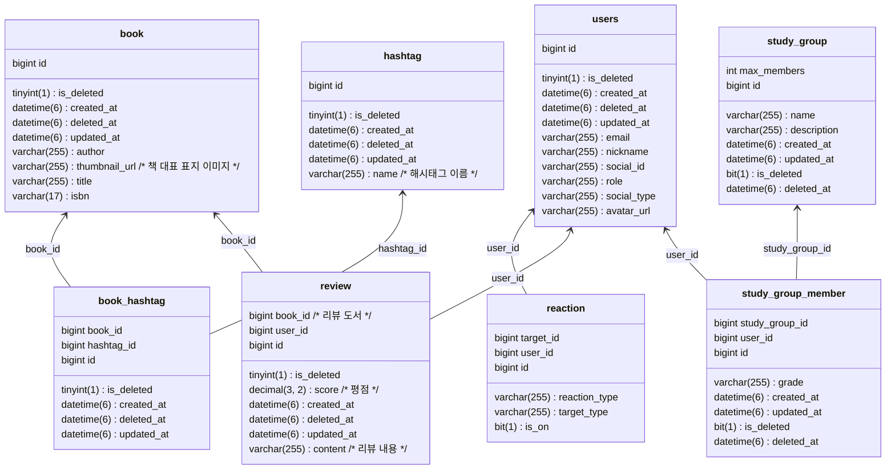

# 📖 HowRead

## CI/CD

 
## ER Diagram

## flyway 절차

1. `src/main/resources/db/migration` 디렉토리에 `V{version}__{description}.sql` 파일을 생성합니다.
2. `./gradlew flywayMigrate` 명령어를 실행합니다. (마이그레이션 시 환경변수에 DB_URL, DB_USERNAME, DB_PASSWORD가 필요합니다.)
