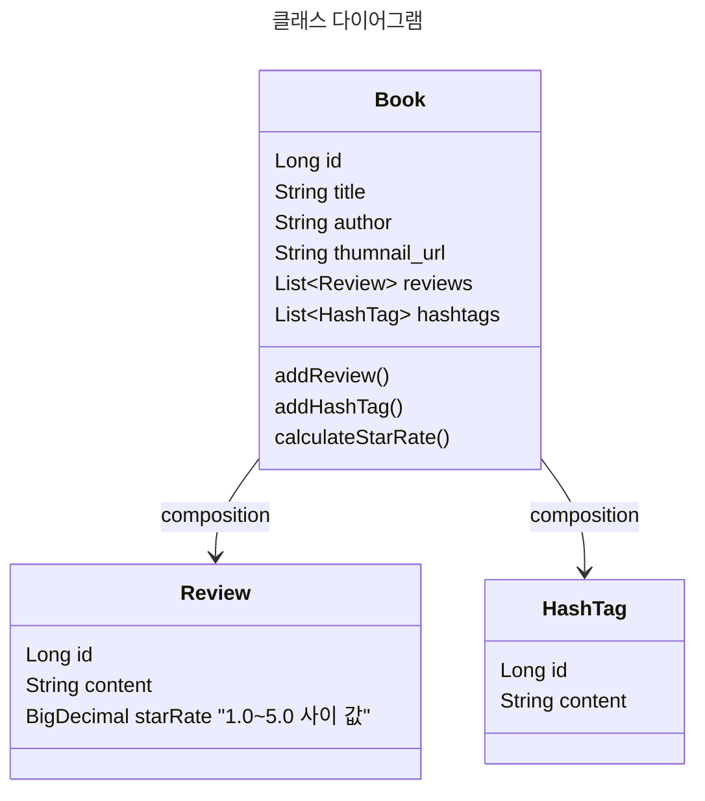
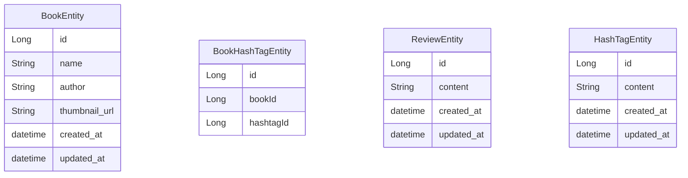

# 책 리뷰

## Domain Class, ER Diagram -> JPA Settings 셋팅

## Diagram

### 1. Class Diagram

domain
- models -> Book, Review, HashTag (비즈니스 객체) (논리적)
- entities -> BookEntity, ReviewEntity, HashTagEntity (Persistency Layer) (물리적)

Book -> HashTags[]



### 2. ER Diagram



# UseCase

## 1. 책을 등록한다.

- 해시태그도 별도 독립적인 객체
  책 -> 해시태그를 등록하라.

book = Book()
hashtag = HashTag()
book.addHashTag(hashTag)

# Book

# HashTag

## 2. 리뷰를 등록한다.

- 리뷰는 리뷰를 작성할 책임이 있다.
- 책한테 리뷰를 추가할 책임이 있다..

```java
Review review = Review();

Book book = Book();
book.

addReview(review);
```

- book
- reviews

- 책은 평점을 계산할 책임을 가지고있다.

```java
BigDecimal starRate = book.calculateStarRate();
```

