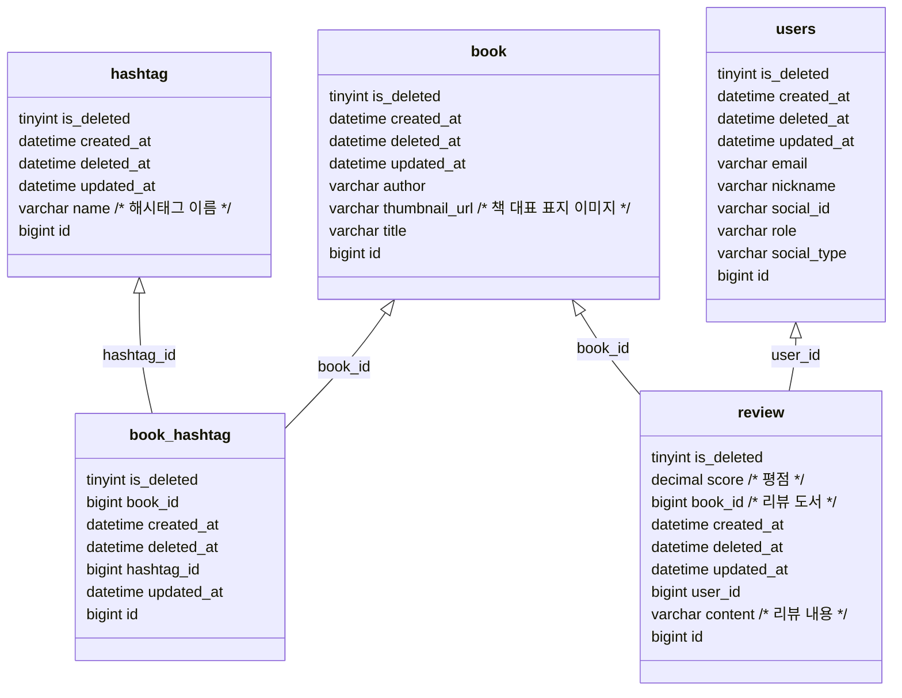

# HowRead

 
## ER Diagram

```mermaid
classDiagram
direction BT
class book {
   tinyint is_deleted
   datetime created_at
   datetime deleted_at
   datetime updated_at
   varchar author
   varchar thumbnail_url  /* 책 대표 표지 이미지 */
   varchar title
   bigint id
}
class book_hashtag {
   tinyint is_deleted
   bigint book_id
   datetime created_at
   datetime deleted_at
   bigint hashtag_id
   datetime updated_at
   bigint id
}
class hashtag {
   tinyint is_deleted
   datetime created_at
   datetime deleted_at
   datetime updated_at
   varchar name  /* 해시태그 이름 */
   bigint id
}
class review {
   tinyint is_deleted
   decimal score  /* 평점 */
   bigint book_id  /* 리뷰 도서 */
   datetime created_at
   datetime deleted_at
   datetime updated_at
   bigint user_id
   varchar content  /* 리뷰 내용 */
   bigint id
}
class users {
   tinyint is_deleted
   datetime created_at
   datetime deleted_at
   datetime updated_at
   varchar email
   varchar nickname
   varchar social_id
   varchar role
   varchar social_type
   bigint id
}

review --|> users : user_id
book_hashtag --|> book : book_id
book_hashtag --|> hashtag : hashtag_id
review --|> book : book_id

```
